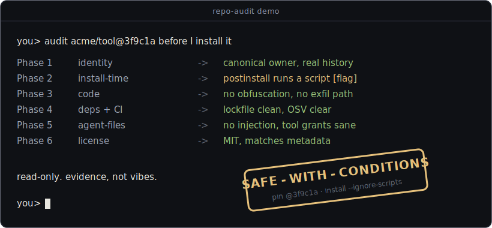

# repo-audit

**A Claude Code / agent skill that reads third-party code for red flags before you install it.**



Agents install third-party skills the way people run `curl | bash`. This skill is the look before running.

Installation is the moment of maximum exposure. Install hooks run arbitrary code with your user's rights, and agent-facing files (skills, MCP servers, hooks) get to whisper instructions to a model that holds your tools and credentials. In registry and repo-level supply-chain compromises the malicious code is usually findable in advance. It ships because nobody looked before running. `repo-audit` is a procedure for looking: a read-only, six-phase pass over any repo, package, skill, plugin, or MCP server that produces a **SAFE / SAFE-WITH-CONDITIONS / UNSAFE** verdict with evidence, every red flag quoted verbatim, and concrete conditions like version pinning.

It is a skill, so your agent runs it. You paste a GitHub or npm link with intent to install, or the agent is about to recommend something, and this procedure runs first.

## What it checks (six phases)

| Phase | Looks at | Catches |
|------:|----------|---------|
| 1 | Identity and reputation | repackaged clones, typosquats, empty-shell accounts, the xz maintainer-swap pattern |
| 2 | What runs at install time | `postinstall` hooks, `setup.py`, `build.rs`, `curl \| bash` installers, auto-running editor/agent config |
| 3 | Code (hotspots first) | obfuscated blobs, `eval` on remote input, credential/wallet/clipboard theft, conditional payloads, invisible/bidi characters, checked-in binaries |
| 4 | Dependencies and CI | install scripts across the whole tree, known-malicious packages (OSV), risky GitHub Actions |
| 5 | Agent-facing files | prompt injection: instructions serving the vendor not you, hidden tool-description blocks, cross-tool shadowing, remote instruction loading, over-broad tool grants |
| 6 | License | missing or mismatched license, uncredited copied code |

Depth scales to blast radius: an agent skill is small text with catastrophic reach, so every file is read; a large library gets a full Phase 1-2 then a hotspot pass, with what was not read declared in the verdict.

## The verdict format

Every audit ends in the same shape, so verdicts stay comparable:

```
## Verdict: SAFE | SAFE-WITH-CONDITIONS | UNSAFE
Target: <owner/repo@commit, pkg@version, or bundle sha256> · audited <date>
Scope: what was read in full, what was sampled, what was NOT checked
Evidence: bullet per finding, each with file:line or the command output that shows it
Red flags: every one, verbatim, even under a SAFE verdict (or "none found")
Conditions (if applicable): pin to <commit SHA/version/hash>, install with --ignore-scripts, verify installer sha256 and run only the verified local copy, sandbox first run, remove/disable <component>, re-audit on update
Verify yourself: 2-4 concrete spot-checks the user can do in minutes
```

## Example audits

Two real runs, written up in full:

- [**UNSAFE**: a repackaged CLI clone hiding a malware dropper](docs/examples/unsafe-repackaged-clone-with-dropper.md). A young low-star repo advertising an installable CLI turned out to be a legitimate project cloned, its README rewritten into a "download and double-click the installer" funnel, with a Windows dropper (`gcm.exe` + obfuscated payload + launcher) checked in. Caught read-only, without ever running the payload.
- [**SAFE-WITH-CONDITIONS**: a third-party Claude skill](docs/examples/safe-with-conditions-claude-skill.md). A mid-size community skill that reprograms how the agent plans and delegates. Security-clean under a full Phase 5 read, but shipped with no license and broad tool grants on its sub-agents: conditions, not a clean bill.

## Quickstart (under 5 minutes)

Clone straight into your skills directory (this keeps `git pull` working for updates):

```bash
# Git Bash, macOS, or Linux
git clone --depth=1 https://github.com/belschak/repo-audit.git ~/.claude/skills/repo-audit
```

```powershell
# Windows PowerShell
git clone --depth=1 https://github.com/belschak/repo-audit.git "$HOME\.claude\skills\repo-audit"
```

The two forms differ on purpose: PowerShell does not treat `~` as your home directory when it passes the path to `git`, so it needs `"$HOME\..."` instead.

### Windows command equivalents

For the few Unix pipe helpers used below, native PowerShell equivalents are:

```powershell
@(git ls-files).Count
$f = @(git ls-files); $f | Group-Object { $_.ToLowerInvariant() } | Where-Object Count -gt 1 | ForEach-Object Group
Invoke-RestMethod -Method Post -Uri https://api.osv.dev/v1/query -ContentType 'application/json' -Body '{"package":{"ecosystem":"npm","name":"<pkg>"}}'
```

The first counts tracked files, the second reports case-insensitive filename collisions, and the third queries OSV. The collision check preserves the `README.md`/`readme.md` distinction that matters on case-sensitive filesystems.

That is it. There is no build and there are no dependencies. The skill triggers when you ask "is this safe?", "audit this repo", "should I install X", when you paste a GitHub/npm/PyPI/marketplace link with intent to install, or when the agent is itself about to recommend or install third-party code. The `gh`, `git`, and `rg` audit commands (including the single-quote regex literals) run unchanged in both bash and PowerShell; use the equivalents above instead of Unix pipe helpers on Windows.

## Honest limits

- **An audit reduces risk; it cannot prove absence of malice.** The verdict states what was checked, what was not, and where residual risk lives. It never claims "100% safe".
- **A verdict binds to one commit or version.** Pin by SHA or artifact hash, never a tag (tags move). Any later update is unaudited by definition, so "re-audit on update" is in every report.
- **The audit is read-only by design.** It fetches, clones, and reads; it never installs, builds, or runs the target. That is the whole point: running it would be the attack succeeding early.
- **Popularity is not an audit.** Stars can be bought and typosquats live off famous names. For famous projects the fast path is verifying you hold the canonical repo, not skipping checks.

## Related skills

- [**web-research-cascade**](https://github.com/belschak/web-research-cascade): when your agent hits a `403`, escalate the *same* source through stronger fetch methods instead of silently summarizing a weaker one. The fetch discipline that pairs with this audit discipline.

## Contributing

Issues and PRs welcome. The audit procedure improves the way this one did: by being run against real repos and hardened from what each run missed. Good first contributions: a new detection pattern with a real example that motivates it, a platform fix (Windows paths, shell quirks), or a sanitized example audit for `docs/examples/`. Details in [CONTRIBUTING.md](CONTRIBUTING.md); issues labeled `good first issue` are scoped to 30 to 60 minutes.

## Disclaimer

This project is not affiliated with, endorsed by, or sponsored by GitHub, npm, PyPI, OSV, Anthropic, or any project named in it. A verdict is one auditor's evidence-based read at a single pinned commit or version on the audit date, not a certification, and the install decision stays yours.

The example audits are good-faith security research in the public interest. Each describes the state of a target at the commit or artifact hash it names, on the date it names, and every finding rests on read-only evidence anyone can reproduce with the "Verify yourself" commands. Targets are named only as far as identifying the security issue requires. Where an example describes a repository as a repackaged clone, naming the legitimate upstream author implies no wrongdoing on their part: they are named as the party whose work was copied, so readers can find the safe original. If you believe an example is inaccurate, open an issue with evidence and it will be corrected or removed.

The audit techniques read only public data through official, documented endpoints and never execute the target. You remain responsible for complying with the terms of service of any site or API you access and with applicable law. Use at your own risk; see [LICENSE](LICENSE) for the warranty disclaimer.

## License

MIT. See [LICENSE](LICENSE).
